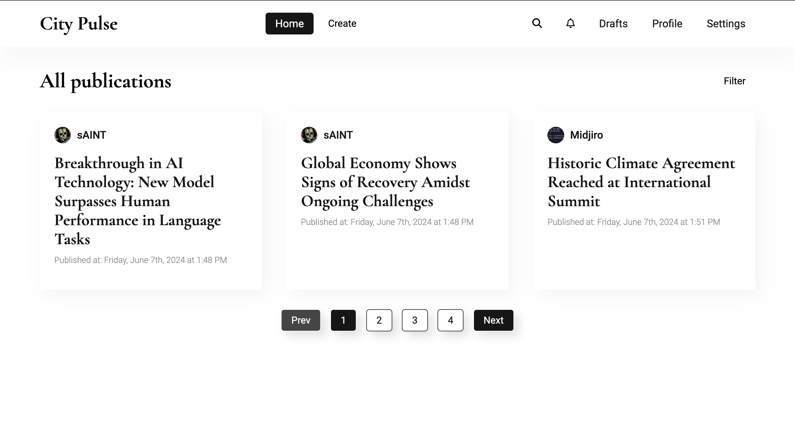

# Local Newsletter

## Technologies

## Description

Is a dynamic web platform designed to empower local communities by facilitating the sharing of news articles and event listings. It fosters a sense of belonging and connectivity among residents, enabling them to stay informed about what's happening in their area.

## Installation

Before start ensure you set GCP Account (OAuth2.0, Service Account, Google Maps API, Storage), MongoDB cluster, Google app password.

-   Clone Repository

    `git clone https://github.com/midjiro/task-list.git`

-   Go to cloned repo and install deps both for client and server

    `npm ci`

-   In the root of the client define the following env variables

          REACT_APP_SERVER_ENDPOINT = "http://localhost:3001"
          REACT_APP_SOCKET_ENDPOINT = "http://localhost:5001"
          REACT_APP_MAP_API_KEY="..."
          REACT_APP_MAP_ID="..."

-   In the root of the server define the following env variables

          CLIENT_ID  = "..."
          CLIENT_SECRET = "..."
          SESSION_SECRET = "..."
          GCS_PROJECT_ID = "..."
          GCS_BUCKET_NAME = "..."
          GCP_PRIVATE_KEY = "..."
          GCP_SERVICE_ACCOUNT_EMAIL = "..."
          MAP_API_KEY="..."

          NODEMAILER_USER = "..."
          NODEMAILER_PASS = "..."

          MONGO_PASSWORD = "..."

          CLIENT_APP_ENDPOINT = "http://localhost:3000"
          SERVER_PORT = 3001
          SOCKET_PORT = 5001
          SECURE = 'false'

-   You are ready to strat working with project locally

    `npm start` - for client
    `npm run dev` - for server

## Contact

Hulak Mykhailo

[Send me an email](miha.gulak@gmail.com)

[Find me on telegram](https://t.me/@midjiro)

## Feature Development & Support

The following feature list will be added in the nearest future:

-   Real time commenting functionality
-   Fix for profile contact section of logged in users

## Usefull information

-   [How to setup GCP OAuth2.0](https://www.youtube.com/watch?v=HtJKUQXmtok)
-   [How to setup Google Map API (you need Maps API, Geocoding API, Places API and separate API keys for client and server)](https://www.youtube.com/watch?v=OGTG1l7yin4)
-   [How to setup GCP Storage and Service Account](https://www.youtube.com/watch?v=_jJ-0ltqoC0)
-   [How to setup nodemailer](https://www.youtube.com/watch?v=nF9g1825mwk&t=389s)
